<div align="center">

# Отчет

</div>

<div align="center">

## Практическая работа №8

</div>

<div align="center">

## Ресурсы. Работа с медиа-элементами

</div>

**Выполнил:**  
Тушканов Виктор Алексеевич  
**Курс:** 2  
**Группа:** ИНС-б-о-24-1  
**Направление:** 09.03.02 «Информационные системы и технологии»  
**Профиль:** «Прикладное программирование в интеллектуальных информационных системах»  

---

### Цель работы

Изучить способы добавления и отображения графических ресурсов, научиться работать с аудио- и видеофайлами в Android-приложениях, освоить управление воспроизведением медиа-контента.

### Ход работы

В рамках практической работы было разработано приложение `MediaLab` на языке Java в среде Android Studio, объединяющее три задания: галерею с поддержкой слайд-шоу, видеоплеер с регулировкой громкости и управление фоновым аудио с приоритетной координацией с видео. Приложение реализовано в виде трёх Activity (`MainActivity`, `VideoActivity`, `AudioActivity`) с навигацией между ними. Для управления фоновым аудио использован класс-синглтон `BackgroundAudioManager`, инициализируемый в подклассе `Application` (`MediaLabApp`), что позволяет аудио непрерывно играть при переходах между экранами.

#### 1. Подготовка ресурсов

В папку `res/drawable/` было помещено четыре изображения формата JPG для галереи. В папку `res/raw/` (создана через **New → Android Resource Directory** с типом `raw`) добавлены короткое аудио (`audio_sample.mp3`) и короткое видео (`video_sample.mp4`).

<div align="center">

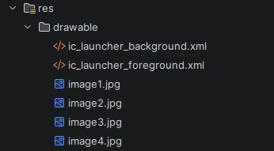

*Рисунок 1. Содержимое папки res/drawable/*

</div>

<div align="center">

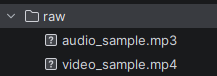

*Рисунок 2. Содержимое папки res/raw/*

</div>

#### 2. Реализация фонового аудио

Класс `MediaLabApp`, наследуемый от `Application`, инициализирует синглтон `BackgroundAudioManager` при старте приложения и запускает фоновое воспроизведение. Класс зарегистрирован в `AndroidManifest.xml` через атрибут `android:name=".MediaLabApp"`.

<div align="center">

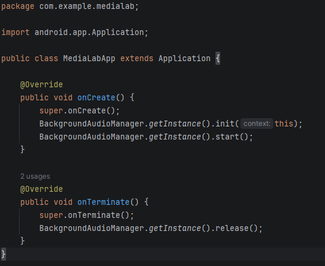

*Рисунок 3. Код класса MediaLabApp (Application)*

</div>

Класс `BackgroundAudioManager` реализован в виде синглтона. В методе `init()` создаётся `MediaPlayer` из ресурса `R.raw.audio_sample`, включается зацикливание `setLooping(true)` и устанавливается резервный `OnCompletionListener` (на случай если зацикливание не сработает). Метод `pauseForVideo()` запоминает состояние воспроизведения и ставит аудио на паузу. Метод `resumeAfterDelay()` использует `Handler.postDelayed()` для возобновления через 1500 миллисекунд.

<div align="center">

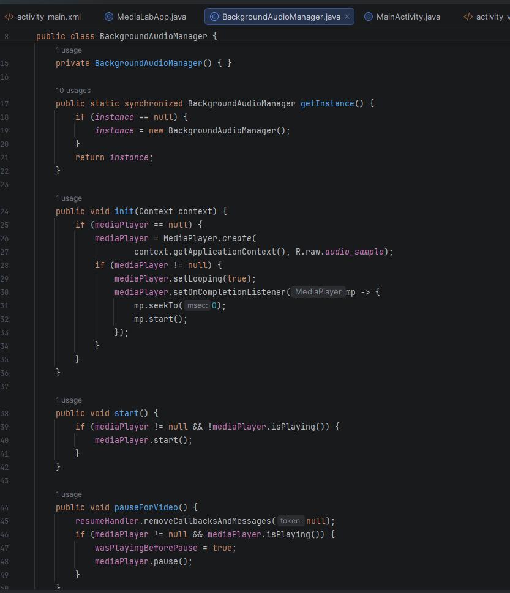

*Рисунок 4. BackgroundAudioManager: инициализация плеера и метод pauseForVideo()*

</div>

<div align="center">

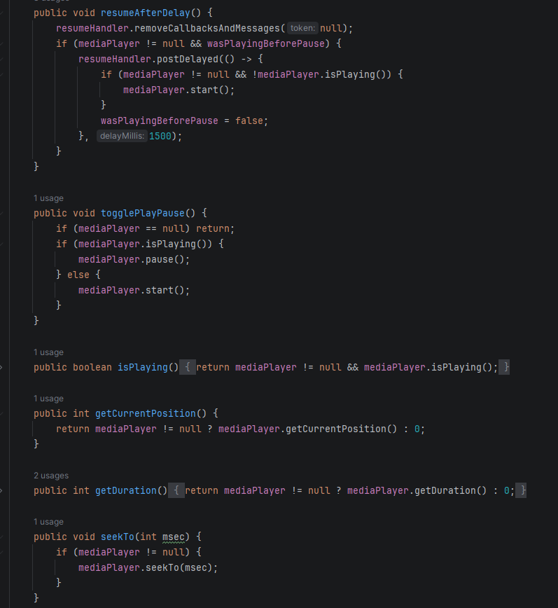

*Рисунок 5. BackgroundAudioManager: возобновление с задержкой и вспомогательные методы*

</div>

#### 3. Галерея изображений и слайд-шоу (Задание 1)

Разметка `activity_main.xml` содержит `ImageView`, текстовый индикатор номера изображения, кнопки «Назад», «Вперёд» и «Запустить слайд-шоу», а также кнопки навигации к видеоплееру и управлению аудио.

<div align="center">

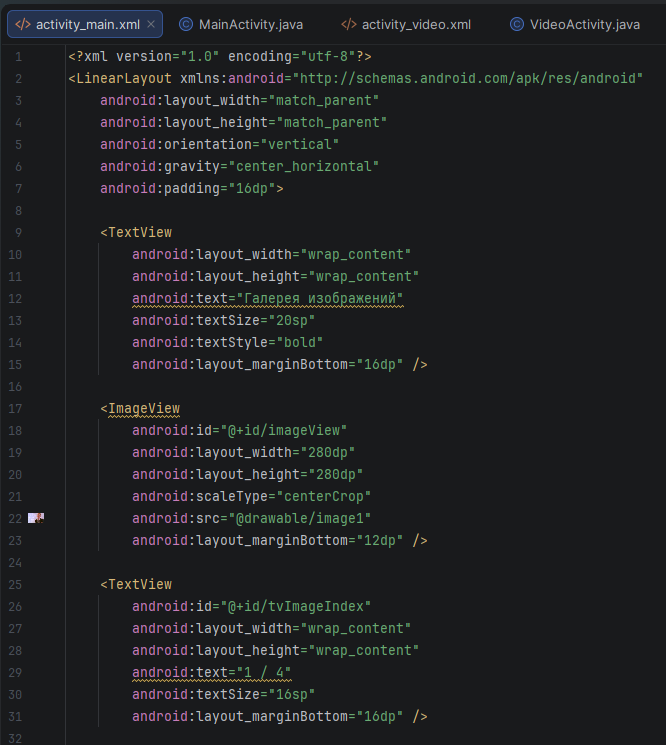

*Рисунок 6. Разметка activity_main.xml: ImageView и индикатор позиции*

</div>

<div align="center">

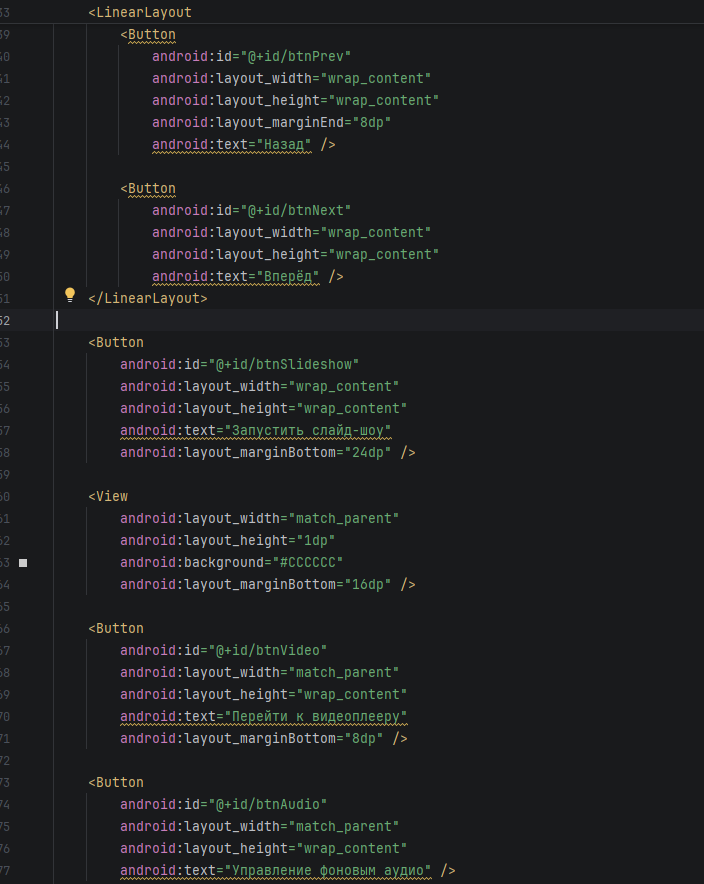

*Рисунок 7. Разметка activity_main.xml: кнопки управления и навигации*

</div>

В `MainActivity.java` реализована логика циклического переключения четырёх изображений из массива `int[] images`. Слайд-шоу запускается с интервалом 3 секунды на основе `Timer` и `TimerTask`, причём смена изображения выполняется через `runOnUiThread()`, поскольку `TimerTask` работает в фоновом потоке. Повторное нажатие на кнопку «Слайд-шоу» останавливает таймер.

<div align="center">

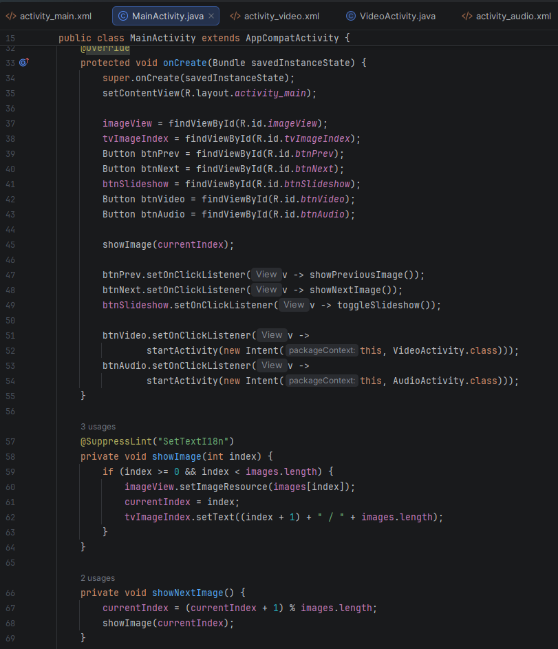

*Рисунок 8. MainActivity: метод onCreate и обработчики кнопок*

</div>

<div align="center">

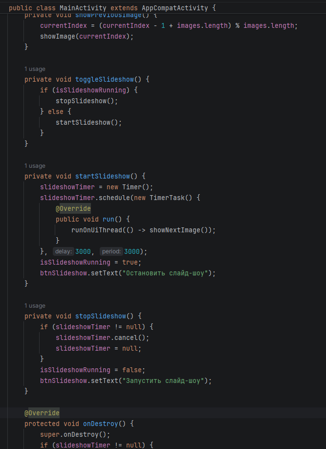

*Рисунок 9. MainActivity: реализация слайд-шоу через Timer + TimerTask*

</div>

#### 4. Видеоплеер (Задание 2)

Разметка `activity_video.xml` включает `VideoView` высотой 300dp, `SeekBar` для регулировки громкости и две кнопки — «Воспроизвести» и «Пауза».

<div align="center">

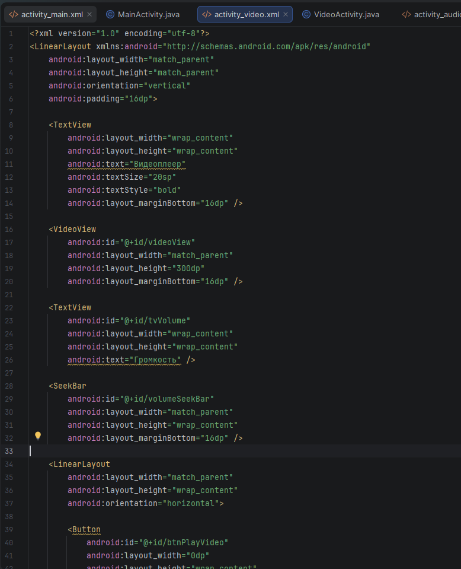

*Рисунок 10. Разметка activity_video.xml*

</div>

В `VideoActivity.java` через `AudioManager` (поток `STREAM_MUSIC`) реализована регулировка громкости с динамическим обновлением подписи в формате `текущее / максимум`. Источник видео задан как `android.resource://` URI к ресурсу `R.raw.video_sample`. К `VideoView` подключён стандартный `MediaController`. При запуске видео вызывается `BackgroundAudioManager.pauseForVideo()`, при паузе/окончании/уходе с экрана — `resumeAfterDelay()`, реализуя приоритет видео над фоновым аудио.

<div align="center">

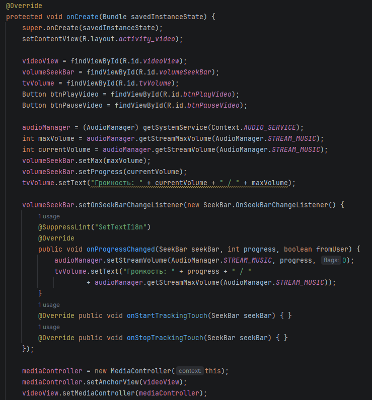

*Рисунок 11. VideoActivity: настройка AudioManager и SeekBar громкости*

</div>

<div align="center">

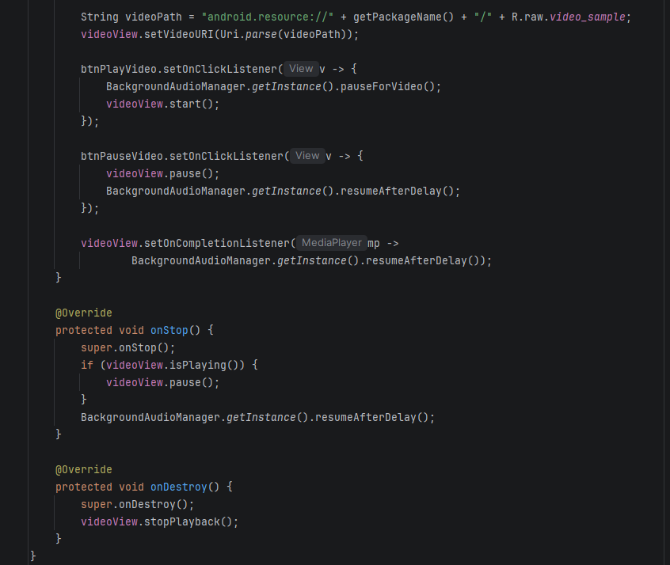

*Рисунок 12. VideoActivity: координация с фоновым аудио и обработка lifecycle*

</div>

#### 5. Управление фоновым аудио (Задание 3 + дополнительное со звёздочкой)

Разметка `activity_audio.xml` содержит заголовок, текстовый индикатор статуса (`Аудио воспроизводится` / `Аудио на паузе`), индикатор времени в формате `MM:SS / MM:SS`, `SeekBar` позиции аудио (`audioSeekBar`), кнопку Play/Pause и второй `SeekBar` для регулировки громкости.

<div align="center">

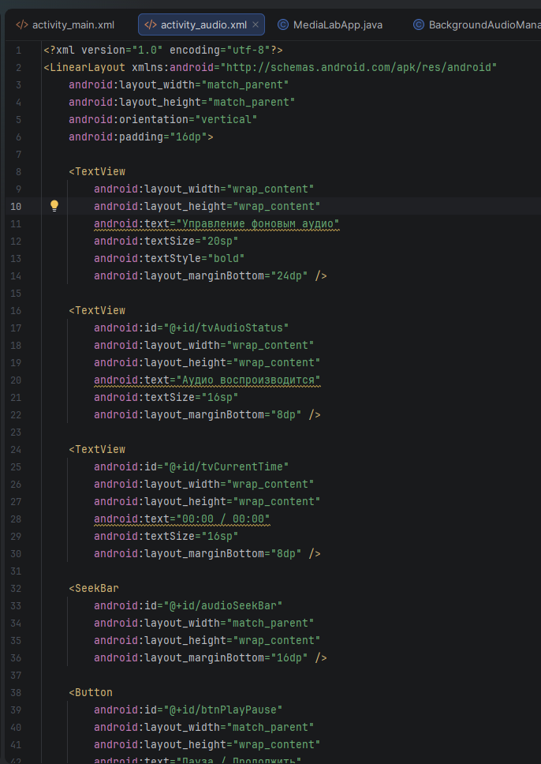

*Рисунок 13. Разметка activity_audio.xml*

</div>

Activity `AudioActivity` реализует управление воспроизведением фонового аудио: кнопку Play/Pause, `SeekBar` для отображения и перемотки текущей позиции (дополнительное задание со звёздочкой), отображение времени в формате `MM:SS / MM:SS`, а также отдельный `SeekBar` громкости. Обновление UI происходит каждую секунду через `Timer + TimerTask` с использованием `runOnUiThread()`. Флаг `isUserSeeking` блокирует автоматическое обновление `SeekBar` в момент пользовательской перемотки, чтобы ползунок не «прыгал» под пальцем.

<div align="center">

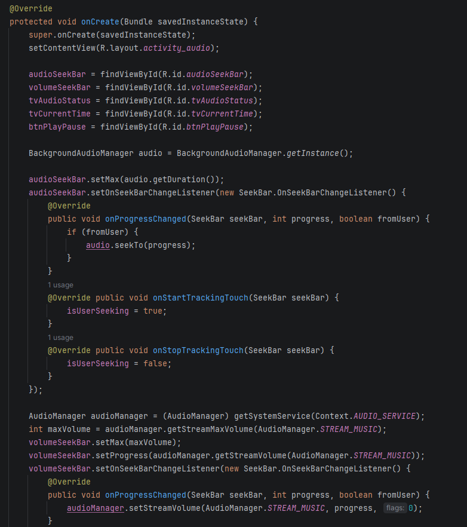

*Рисунок 14. AudioActivity: инициализация и SeekBar позиции аудио*

</div>

<div align="center">

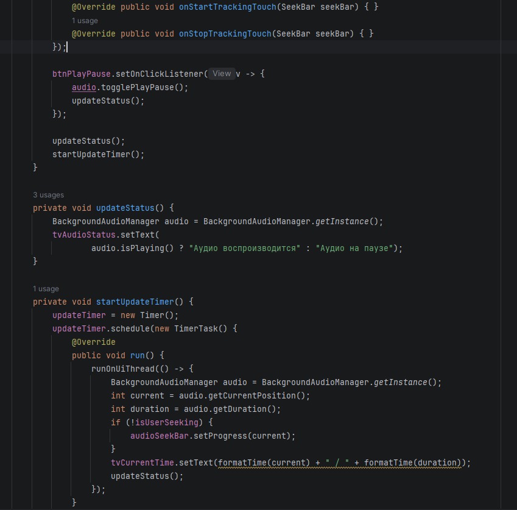

*Рисунок 15. AudioActivity: периодическое обновление UI через Timer*

</div>

#### 6. Результат запуска приложения

После запуска приложения отображается главный экран — галерея с навигацией. Слайд-шоу запускается и останавливается одной кнопкой, индикатор `1 / 4` отображает текущую позицию.

<div align="center">

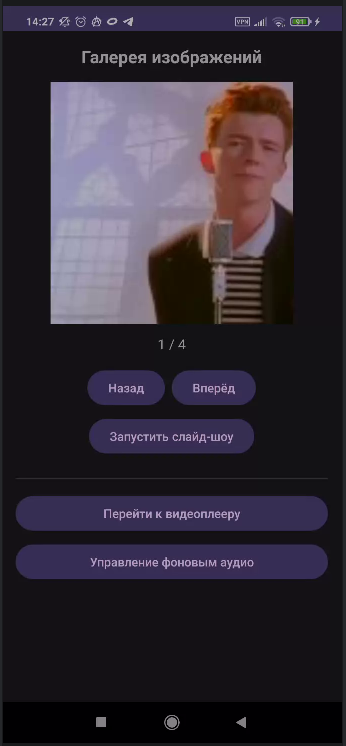

*Рисунок 16. Главный экран: галерея изображений*

</div>

При переходе к видеоплееру фоновое аудио ставится на паузу. Громкость регулируется ползунком с отображением текущего и максимального значений; в данном случае `Громкость: 3 / 15`.

<div align="center">

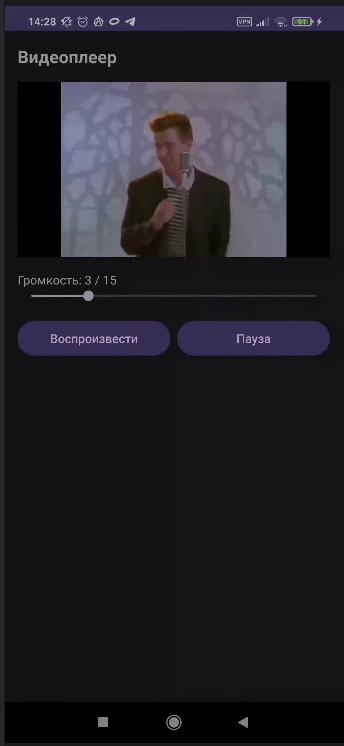

*Рисунок 17. Экран видеоплеера с регулировкой громкости*

</div>

Экран управления фоновым аудио показывает текущую позицию воспроизведения и общую длительность файла (`00:06 / 00:17`), позволяет перематывать аудио ползунком и регулировать громкость отдельным `SeekBar`.

<div align="center">

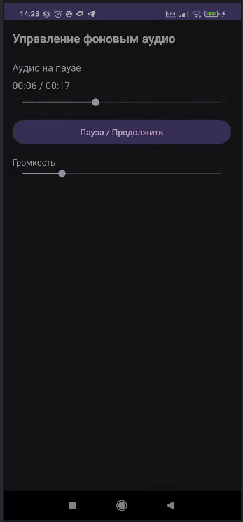

*Рисунок 18. Экран управления фоновым аудио*

</div>

### Вывод

В результате выполнения практической работы я изучил систему ресурсов Android (папки `drawable`, `raw`, `values`, `layout`), научился отображать изображения через `ImageView`, воспроизводить аудио через `MediaPlayer` и видео через `VideoView` с подключением `MediaController`. Был освоен класс `AudioManager` для программной регулировки громкости и `SeekBar` для отображения и управления прогрессом воспроизведения. Реализован периодический опрос состояния плеера через `Timer + TimerTask` с корректным обновлением UI в главном потоке через `runOnUiThread()`. Дополнительно реализована координация двух медиа-источников — фонового аудио и видео — с системой приоритетов и отложенным возобновлением через `Handler.postDelayed()`. Архитектурно вынесение управления аудио в синглтон, инициализируемый в подклассе `Application`, позволило корректно сохранять состояние воспроизведения при переходах между Activity.

### Ответы на контрольные вопросы

1.  **Какие типы ресурсов существуют в Android? Для чего предназначены папки `drawable`, `raw`, `values`?**  
Ресурсы Android — это внешние данные приложения, размещаемые в папке `res/`. Основные категории: `drawable/` — графические ресурсы (PNG, JPG, XML-векторы, shape-drawables); `raw/` — произвольные двоичные файлы в исходном виде, доступ через `R.raw.имя_файла` (используется для аудио, видео, JSON и т.п.); `values/` — XML-файлы со строками (`strings.xml`), цветами (`colors.xml`), размерами (`dimens.xml`), стилями и массивами; `layout/` — XML-разметки экранов; `mipmap/` — иконки приложения с поддержкой плотностей; `menu/` — описания меню; `xml/` — произвольные XML-конфигурации. Для разных конфигураций (плотность экрана, ориентация, язык) поддерживаются квалификаторы вида `drawable-xhdpi`, `values-ru`, `layout-land` и т.д.

2.  **Как добавить изображение в приложение и отобразить его в `ImageView` двумя способами (из ресурсов и из файловой системы)?**  
*Из ресурсов:* поместить файл в `res/drawable/` и указать в XML `android:src="@drawable/my_image"` либо в коде вызвать `imageView.setImageResource(R.drawable.my_image)`.  
*Из файловой системы:* считать файл через `BitmapFactory.decodeFile(path)` и установить через `imageView.setImageBitmap(bitmap)`. Для доступа к файлам пользователя в современных версиях Android (10+) рекомендуется использовать Storage Access Framework (`ACTION_OPEN_DOCUMENT`) и получать `Uri`, по которому изображение загружается через `getContentResolver().openInputStream(uri)` и `BitmapFactory.decodeStream()`. Для Android 13+ при работе с медиафайлами галереи требуется разрешение `READ_MEDIA_IMAGES`.

3.  **Опишите жизненный цикл `MediaPlayer`. Какие методы необходимо вызвать для воспроизведения аудиофайла из ресурсов?**  
Состояния `MediaPlayer`: `Idle` (после `new MediaPlayer()`) → `Initialized` (после `setDataSource()`) → `Prepared` (после `prepare()` или `prepareAsync()`) → `Started` (после `start()`) → `Paused` (`pause()`) ↔ `Started` → `Stopped` (`stop()`) → повторно `Prepared` через `prepare()` → `End` (`release()`). Существуют также состояния `Error` и `PlaybackCompleted`. Для воспроизведения файла из `res/raw` достаточно использовать статический фабричный метод: `MediaPlayer mp = MediaPlayer.create(context, R.raw.audio_sample);` (он уже возвращает плеер в состоянии `Prepared`), затем `mp.start()`. По окончании работы обязателен `mp.release()` для освобождения системных ресурсов.

4.  **Для чего используется класс `AudioManager`? Как получить его экземпляр и изменить громкость?**  
`AudioManager` — системный сервис управления аудиополитиками устройства: режимы звонка, маршрутизация (динамик/наушники), громкость различных аудиопотоков (`STREAM_MUSIC`, `STREAM_RING`, `STREAM_ALARM` и др.), запрос аудиофокуса. Экземпляр получается через `AudioManager am = (AudioManager) getSystemService(Context.AUDIO_SERVICE);`. Для изменения громкости медиа-потока:
```java
int max = am.getStreamMaxVolume(AudioManager.STREAM_MUSIC);
int curr = am.getStreamVolume(AudioManager.STREAM_MUSIC);
am.setStreamVolume(AudioManager.STREAM_MUSIC, newVolume, 0);
```
Третий параметр — флаги (например, `FLAG_SHOW_UI` для отображения системного индикатора громкости).

5.  **Что такое `VideoView` и `MediaController`? Как их использовать для создания простого видеоплеера?**  
`VideoView` — готовый виджет, наследник `SurfaceView`, инкапсулирующий внутренний `MediaPlayer` и поверхность отрисовки видео. `MediaController` — всплывающая панель стандартных элементов управления (play/pause, перемотка, индикатор времени), привязываемая к плееру. Простой видеоплеер собирается из четырёх шагов: добавить `VideoView` в разметку, задать источник через `setVideoURI(Uri.parse("android.resource://" + getPackageName() + "/" + R.raw.video_sample))`, создать и привязать `MediaController` через `setAnchorView(videoView)` и `videoView.setMediaController(mc)`, затем вызвать `videoView.start()`. В `onDestroy()` следует вызвать `videoView.stopPlayback()`.

6.  **Почему при обновлении UI (например, `SeekBar`) из `TimerTask` нужно использовать `runOnUiThread()`?**  
`TimerTask` выполняется в фоновом (не главном) потоке Timer'а. В Android существует строгое правило: к компонентам пользовательского интерфейса (View) можно обращаться только из главного (UI) потока — иначе будет выброшено исключение `CalledFromWrongThreadException` (или `android.view.ViewRootImpl$CalledFromWrongThreadException`). Метод `Activity.runOnUiThread(Runnable)` ставит задачу в очередь главного `Looper`, что гарантирует её выполнение в UI-потоке. Альтернативы — `View.post(Runnable)` или `new Handler(Looper.getMainLooper()).post(...)`.

7.  **Как сделать, чтобы аудиофайл воспроизводился бесконечно (зацикливался)?**  
Самый простой и предпочтительный способ — `mediaPlayer.setLooping(true)` сразу после создания плеера. При этом по достижении конца файла плеер автоматически переходит к началу без вызова `OnCompletionListener`. Альтернатива — установить `OnCompletionListener`, в котором вручную вызвать `mp.seekTo(0); mp.start();`. Эта схема полезна, когда нужна сложная логика (например, переход к следующему треку плейлиста). В разработанном приложении используется первый способ как более надёжный и экономичный, с резервным `OnCompletionListener` на случай некорректного поведения некоторых кодеков.

8.  **Какие разрешения необходимы для доступа к медиафайлам на внешнем хранилище в разных версиях Android?**  
До Android 6 (API 22) — статическое разрешение `READ_EXTERNAL_STORAGE` объявлялось только в манифесте. С Android 6 (API 23) и выше требуется runtime-запрос разрешения через `ActivityCompat.requestPermissions()`. С Android 10 (API 29) введён режим Scoped Storage: приложение по умолчанию имеет доступ только к своему каталогу и собственным медиафайлам, для произвольных файлов рекомендуется использовать Storage Access Framework. С Android 13 (API 33) разрешение `READ_EXTERNAL_STORAGE` для медиа заменено на гранулярные: `READ_MEDIA_IMAGES`, `READ_MEDIA_VIDEO`, `READ_MEDIA_AUDIO`. С Android 14 (API 34) добавлено `READ_MEDIA_VISUAL_USER_SELECTED` для частичного доступа только к выбранным пользователем фото и видео. В разработанном приложении разрешения не требуются, поскольку все медиафайлы упакованы в `res/raw` и `res/drawable` и являются частью APK.
